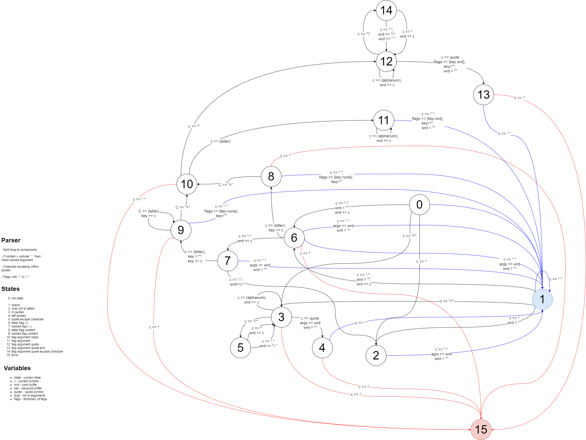
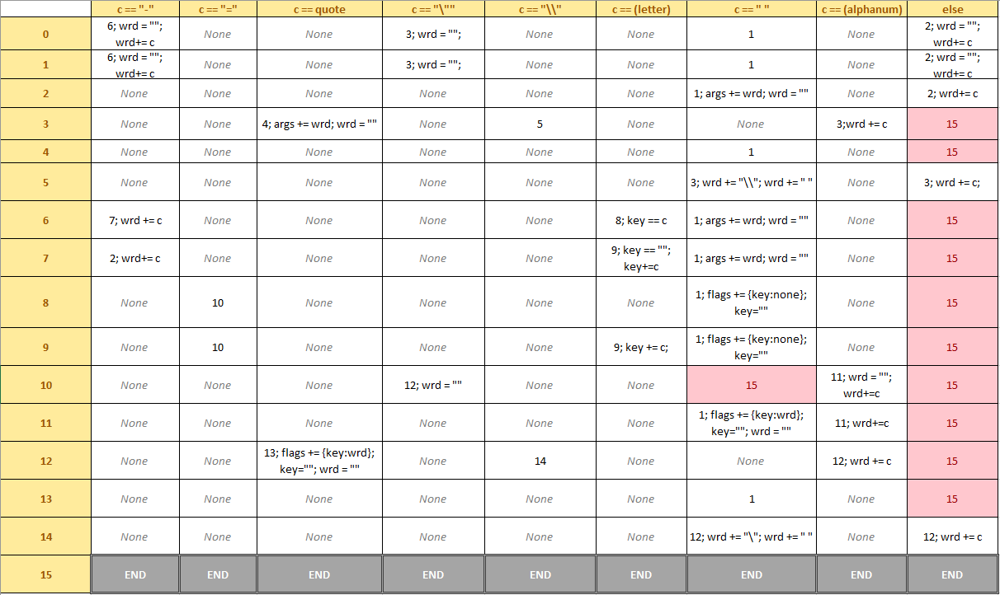

# About how parser works

## [EN]

### Math

To create parser I've used discrete math model that's called **finite state machine**. You can read more about it [at wiki](https://en.wikipedia.org/wiki/Finite-state_machine). Shortly I can describe it like: it's algorythm that changes its state depending on input. For example: to split string `I've got "many apples"` to words but keep what is in quotes solid. Also let varaible `c` be variable that contains current letter, varaible `wrd` will contain whole word, and array `res` which will sollect all words. 

When machine gets into word it changes the state to 1th. While `c` is alphanumeric it is beind added to `word` variable which is string. When machine approaches space symbol it saves current `word` variable to `res` and resets it, also changes state to 0. But when machine reaches quotes it changes state to 2, in which it will save every symbol including spaces. Letter by letter it gets to the secound quote, and when it does it changes state to 1, but don't forget that we saved every symbol so our `word == "many apples"`, save it and we are done because of end of string.

Result will be: `["I've", "got", "many apples"]`

### Graph

To describe how machine changes states and which conditionals must be satisfied we use graphs.



### Table

Also it can be described using table, in which we have crosses of states with current symbol and result in cell at crossing. Firts number in each cell it is state machine changes to.




### What it does

Example:

```
Input: 'a-search all --danbooru -q="raphtalia"'

Output: datatype RequestHanler:

                    command = 'search'

                    args = ['all']

                    flags = {
                        "danbooru" : None,
                        "q" : "raphtalia"
                    }
```